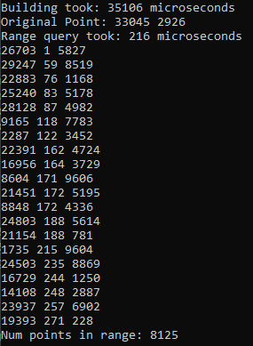

# 2D Range Search Benchmarks

## Range Tree with Fractional Cascading

O(logn) query, O(nlogn) build time. This is an edited fork of an implementation by github.com/luoyuanlab

### Versus Boost RTree ###
1.71x faster Range Search and 2.14x faster build time compared to Boost's RTree

### Search Distance = 5000 out of 65535

### Search Distance = 50000 out of 65535

# TODO:
Replace sort algorithm in Range Tree with pdqsort or vqsort
