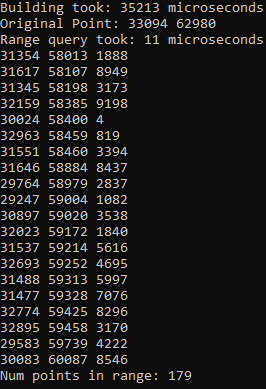

# 2D Range Search Benchmarks

## Range Tree with Fractional Cascading

O(logn) query, O(nlogn) build time

### Random Case: Search Distance = 500 out of 65535

### Worst Case: Search Distance = 50000 out of 65535

TODO:
Replace sort algorithm in Range Tree with pdqsort or vqsort
